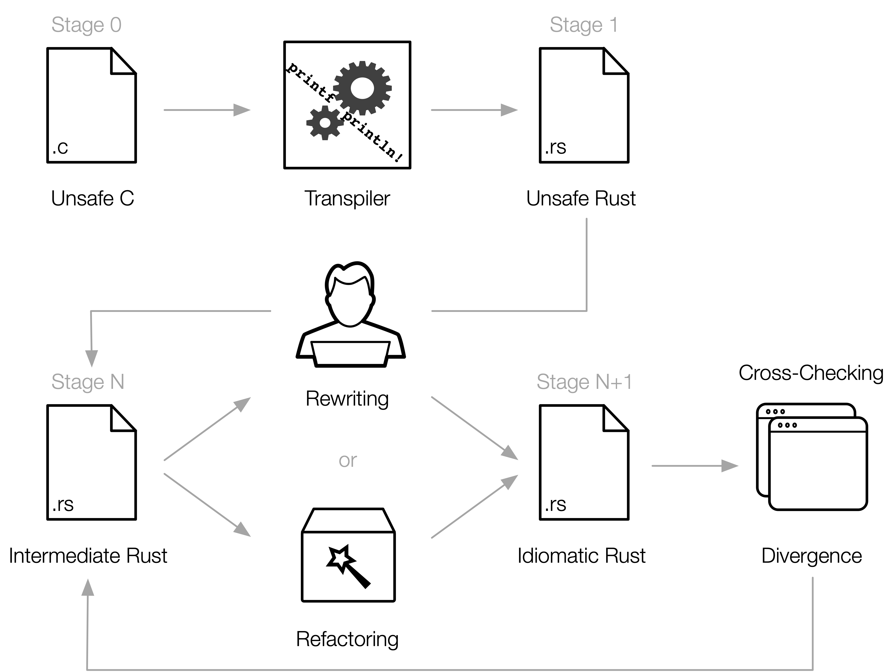

# What is C2Rust?

C2Rust helps you migrate C99-compliant code to Rust. It provides:
- a C to Rust translator, 
- a Rust code refactoring tool, and
- a way to cross-check the C code against the new Rust code.

The translator (or transpiler), produces unsafe Rust code that closely mirrors the input C code. The primary goal of the translator is to produce code that is functionally identical to the input C code. Generating safe or idomatic Rust is *not* a goal for the translator. Rather, we think the best approach is to gradually clean up the translator using dedicated refactoring tools. See the `rust-refactor` directory to learn about the `idiomize` tool that we are working on.
Some refactoring will have to be done by hand which may introduce errors. We provide plugins for `clang` and `rustc` so you can compile and run two binaries and check that they behave identically (at the level of function calls).
See details in the `cross-checks` directory and in the cross checking [tutorial](docs/cross-check-tutorial.md). Here's the big picture:

To learn more, check out our [RustConf'18](https://www.youtube.com/watch?v=WEsR0Vv7jhg) talk on YouTube and try the C2Rust translator online at [www.c2rust.com](https://www.c2rust.com).

# Setting up a development environment

There are three ways to build the C2Rust project:

- Using **Vagrant**. See our [vagrant README](vagrant/README.md).
- Using **Docker**. See our [docker README](docker/README.md).
- **Manually**, as explained below.

The previous two options automatically install all prerequisites during provisioning. You can also provision a macOS or Linux system manually.

* If you are on a Debian-based OS, you can run `scripts/provision_deb.sh` to do so. 

* If you are on macOS, install the Xcode command-line tools (e.g., `xcode-select --install`) and [homebrew](https://brew.sh/) first. Then run `scripts/provision_mac.sh`.

* If you prefer to install dependencies yourself, or are using a non Debian-based Linux OS, our dependencies are as follows:
    - cmake >= 3.9.1
    - dirmngr
    - curl
    - git
    - gnupg2
    - gperf
    - htop
    - ninja
    - unzip
    - clang 5.0+
    - intercept-build or bear - see section on `compile_commands.json` generation
    - python-dev
    - python 3.6+
    - [python dependencies](scripts/requirements.txt)
    - rustc [version](rust-toolchain)
    - rustfmt-preview component for the above rustc version

# Building

Building from scratch takes a little while. The script has been tested on recent versions of macOS and Ubuntu.

    $ ./scripts/build_translator.py

To use the cross checking functionality, add the following option.

    $ ./scripts/build_translator.py --with-clang

# Testing (Optional)

Tests are found in the [`tests`](tests) folder. If you build the translator successfully, you should be able to run the tests with:

    $ ./scripts/test_translator.py tests

This basically tests that the original C file and translated Rust file produce the same output when compiled and run. More details about tests are in [this README](tests/README.md).

 [0]: docs/building-ast-exporter.md

# Translating C to Rust

The translator is driven by a `compile_commands.json` file. This is a [standard](https://clang.llvm.org/docs/JSONCompilationDatabase.html) way to capture compiler invocations and is used by many other tools. The best way to [generate 
 `compile_commands.json` files](#generating) depends on your build system. 

    $ ./scripts/transpile.py path/to/compile_commands.json

To generate a `Cargo.toml` template for a Rust library, add the `-e` option:

    $ ./scripts/transpile.py -e path/to/compile_commands.json

To generate a `Cargo.toml` template for a Rust binary, do this:

    $ ./scripts/transpile.py -m myprog path/to/compile_commands.json

Where `-m myprog` tells the transpiler to use the `main` method from `myprog.rs` as the entry point.

The translated Rust files will not depend directly on each other like
normal Rust modules. They will export and import functions through the C
API. These modules can be compiled together into a single static Rust
library.

There are several [known limitations](docs/known-limitations.md)
in this translator. The translator will attempt to skip function definitions that use unsupported features.

## Generating `compile_commands.json` files

The `compile_commands.json` file can be automatically created using
either `cmake`, `intercept-build`, or `bear` (Linux only).

It may be a good idea to remove optimizations(`-OX`) from the compile commands
file, as there are optimization builtins which we do not support translating.

### ... with `cmake`

When creating the initial build directory with cmake specify
`-DCMAKE_EXPORT_COMPILE_COMMANDS=1`. This only works on projects
configured to be built by `cmake`. This works on Linux and MacOS.

    $ mkdir build
    $ cd build
    $ cmake -DCMAKE_EXPORT_COMPILE_COMMANDS=1 ..

### ... with `intercept-build`

Intercept build is distributed with clang and recommended for makefile projects on macOS.

	$ intercept-build make
	$ intercept-build xcodebuild

### ... with `bear`

When building on Linux, *Bear* is automatically built by the
`build_translator.py` script and installed into the `dependencies`
directory.

    $ ./configure CC=clang
    $ bear make

# FAQ

> Are there release binaries? Can I install C2Rust with Cargo?

Hope to release binaries that you can `cargo install` soon(tm).

> I translated code on platform X but it didn't work correctly on platform Y

We run the C preprocessor before translation to Rust. This specializes the code to the host platform. For this reason, we do not support cross compiling translated code at the moment. 

> What platforms can C2Rust be run on?

The translator and refactoring tool support both macOS and Linux. Other features, such as cross checking the functionality between C and Rust code, are currently limited to Linux hosts. 

## Acknowledgements and Licensing

This material is available under the BSD-3 style license as found in the
`LICENSE` file.

The C2Rust translator is inspired by Jamey Sharp's [Corrode](https://github.com/jameysharp/corrode) translator. We rely on 
[Emscripten](https://github.com/kripken/emscripten)'s 
Relooper algorithm to translate arbitrary C control flows.

This material is based upon work supported by the United States Air Force and
DARPA under Contract No. FA8750-15-C-0124.  Any opinions, findings and
conclusions or recommendations  expressed in this material are those of the
author(s) and do not necessarily reflect the views of the United States Air
Force and DARPA.  Distribution Statement A, “Approved for Public Release,
Distribution Unlimited.”
